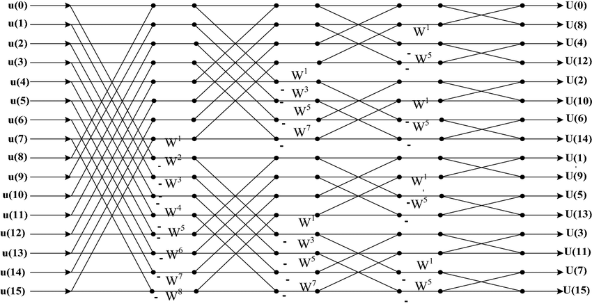
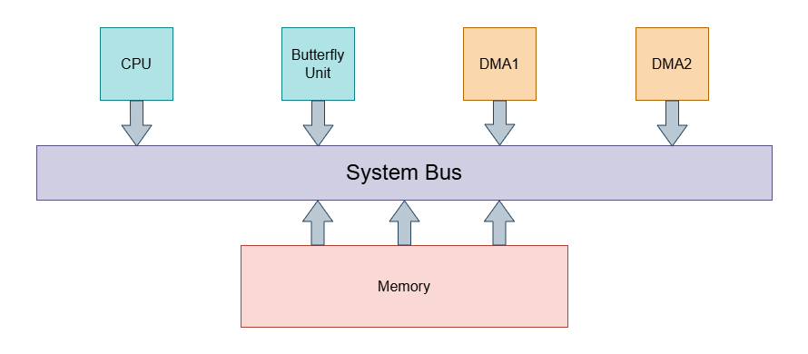

# Performance Analysis for FFT Algorithm using a Processor and one Butterfly Unit

## Abstract
This project focuses on the design and performance evaluation of a System-on-Chip (SoC) architecture that performs the Fast Fourier Transform (FFT) algorithm by providing the processor with a dedicated Butterfly Unit and two Direct Memory Access (DMA) Units. The architecture aims to optimize FFT computation by reducing latency and increasing throughput. The performance of the SoC was measured using the Platform Architect tool.

## 1. Introduction

### 1.1 Background
The Fast Fourier Transform (FFT) is a widely used algorithm in signal processing, enabling efficient computation of the Discrete Fourier Transform (DFT). FFT has applications in a range of fields, including communications, audio processing, and image analysis. However, the computational complexity of FFT can lead to high execution times and energy consumption, especially in embedded systems and real-time applications.

### 1.2 FFT Signal Flow Graph

### 1.3 Problem Statement
In many applications, the processing power required for FFT computations exceeds the capabilities of general-purpose processors, leading to increased energy consumption and slower execution times. Dedicated accelerators, such as a Butterfly Unit, offer a potential solution by performing the repetitive arithmetic operations of the FFT more efficiently.

## 2. Platform Architect Setup

### 2.1 Platform Architect Tool Overview
Platform Architect (PA) is a tool used to model and simulate the SoC architecture. It allows for the integration of various components such as processors, memory, and accelerators, and provides detailed performance metrics such as throughput, latency, and power consumption.

### 2.2 Platform Architect Methodology
The SoC was modeled in PA with the following components: Hardware Model and Workload Model. The user assigns each task in the workload model to a hardware component, specifically Virtual Processing Units (VPU), in order to model the SoC performance at a certain workload. At the end, the user goes to the simulation part, where they can choose the types of analyses they want and check if the mentioned requirements and Key Performance Indicators (KPIs) are met or not.

### 2.3 Platform Architect Hardware Model
PA supports five main types of hardware components, in addition to specific models for some famous hardware components:
- **Virtual Processing Units (VPU)**: It represents a processing resource for a number of tasks.
- **Clock Generators**: It provides the clock source to the system.
- **Reset Generators**: It provides the reset to all system components.
- **Memory Subsystems**: It provides a generic memory block to the system without any specified features.
- **Bus**: It supports different types of famous protocols.

The VPU is the most critical hardware component as it can model a processor or an accelerator. Every VPU has three major parts: Scheduler, Processing Element, and Driver.

- **Scheduler**: It gets the task requests via the task mapping interface and dispatches them according to its configuration to the available resource blocks of the VPU.
- **Processing Element (PE)**: This is a resource block that can execute compute load requests from tasks.
- **Driver**: This is a resource block that can execute the memory load (read/write) requests from the tasks.

### 2.4 Platform Architect Workload Model
**Workload Modeling** is based on the concept of Task Graphs, which split the target application into coarse-grained blocks. These blocks are called tasks. The tasks may run in parallel because they are operating on different sets of data at a time. The target application is divided into coarse-grained blocks. These blocks are called tasks. The tasks may run in parallel because they are operating on different sets of data at a time. 
Task graphs are directed graphs where each task represents a basic workload block, characterized by compute load and/or memory access load. The compute load of a task is specified in processing cycles to specify how many cycles a resource (like a CPU) would have to spend to execute this task. The memory load of a task is specified in a number of bytes that need to be written or read.

- The source task (here Task A) can put samples/tokens into the channel after its activation. If the channel/FIFO size is limited, the source task cannot write the samples and will be blocked. It needs to wait until there is enough space in the channel again.
- The sink task needs one or more samples (configurable) to be activated. If the required number of samples is not available in the channel, it is blocked and needs to wait until the required number of tokens is available. For every activation, it will then remove the required number of samples from the channel.

### 2.5 Platform Architect Mapping and Simulation
The last stage of the flow is mapping the tasks to VPUs. Each task has to be mapped to one VPU, but the VPU can be assigned to more than one task, and the utilization and latency of each VPU will be calculated based on the execution of each task. Eventually, we simulate the system with any chosen type of analysis and extract the performance metrics that we need, like the utilization, to evaluate the proposed architecture.

## 3. System-on-Chip Architecture

### 3.1 Overview of the SoC Architecture
The proposed SoC architecture consists of several key components:
- **Processing Unit**: A central processing unit (CPU) responsible for managing data flow and control.
- **Butterfly Unit**: A hardware accelerator specifically designed to perform the core FFT operations.
- **Dual DMA Units**: Two DMA units that handle high-speed memory transfers, enabling fast data movement between memory and the Butterfly Unit without involving the CPU.
- **Memory**: Serves both as the source of input data and as storage for the results of the FFT computation. This memory is shared between the CPU, Butterfly Unit, and DMA units.
- **System Bus**: High-speed communication channels between the processor, memory, DMA units, and the Butterfly Unit.

### 3.2 Block Diagram for SoC Architecture

### 3.3 Data Width of the Bus
The chosen type of system bus is **AXI Protocol** with a 64-bit data width, and a parameter in the hardware is assigned to specify the maximum number of transferred bytes per cycle.

## 4. FFT Algorithm Workload Model

### 4.1 Workload Model Using Task Graphs

**Note**: The numbers inside red squares represent the processing cycles, and the numbers inside purple squares represent read bytes and write bytes, respectively. 

### 4.2 Defined Variables and Assumptions inside Task Graph
There are three defined variables inside the task graph:
- **FFTLen**: It determines the number of FFT points.
- **Stages_Num**: It represents the number of stages per FFT operation. It depends on **FFTLen** and must equal log2(FFTLen).
- **Repeatation**: It describes the number of total desired FFT operations on many operands.

We assume that a number in our system is a **complex two-byte number**, with one byte for the real part and one byte for the imaginary part. Additionally, DMA1 is responsible for sending the data to the Butterfly Unit from memory, while DMA2 is responsible for receiving the data from the Butterfly Unit to put them in memory.

### 4.3 Workload Tasks

| Task                | Description                                        | Notes |
|:--------------------|:---------------------------------------------------|:------|
| Initialize          | It writes all the start bytes in the memory.       | These bytes = FFTLen * Repeatation * 2 |
| Cal_Str             | It calculates the first and second addresses and the size of DMA incrementing, then writes these bytes to DMA1. | None |
| Trigger             | It triggers the DMA to start their operations.     | DMA1 is responsible for sending the data to the Butterfly Unit. |
| DMA1_Rd             | It represents the read memory access load of DMA1. | None |
| DMA1_Wr             | It represents the write memory access load of DMA1. | None |
| ADD_MUL             | It represents the computation load on the Butterfly Unit. | None |
| DMA2_Rd             | It represents the read memory access load of DMA2. | None |
| DMA2_Wr             | It represents the write memory access load of DMA2. | None |
| FFT_VLD             | It indicates that the FFT operation is done and complete. | None |

### 4.4 Workload Channels
There are two important parameters for each channel. We used them to make the workload operate properly: **put_samples**, **get_samples**, and **init_samples**.

- **put_samples**: It indicates that for each task iteration, two samples will be put into the FIFO/connection.
- **get_samples**: It indicates that for each task iteration, two samples must be available in the FIFO/connection.
- **init_samples**: It is used to put initial samples inside the FIFO.

These channel parameters, besides the self-defined parameters, helped us to implement the algorithm and made it parameterized by the length of FFT points.

## 5. Mapping and Simulation Results

### 5.1 Mapping of Tasks to VPUs

### 5.2 Simulation Results

**Note**: This result is for an 8-point FFT with repetition 2 and maximum transfer bytes of 4 bytes.

## 6. Resources

### 6.1 Platform Architect Manuals
After opening the PA GUI, you can find these manuals from the help menu in the menu bar, then select PDF Manuals.

### 6.2 SolvNet Synopsys
Synopsys provides good lectures and labs about Platform Architect.
Link: https://solvnet.synopsys.com.
Course Name: Platform Architect: Quickstart Training.

## Author Information
Mohamed Elsayed Abouelhamd Mohamed Moussa  
ADI Digital Design Intern  
Date: 27-2-2025
